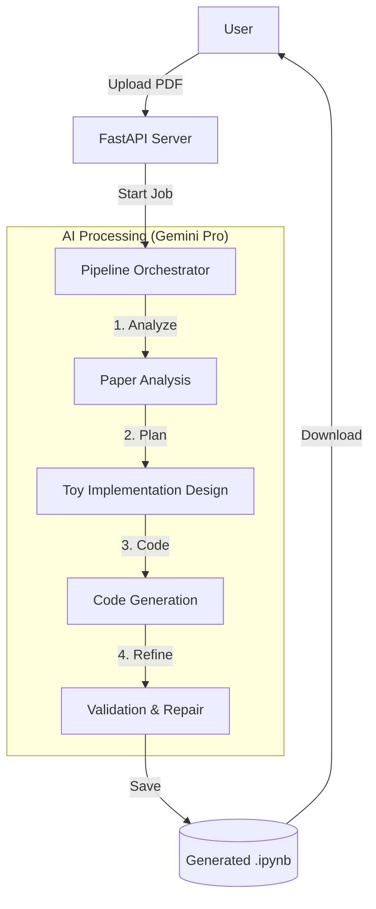

# 📄 Paper to Notebook

**Turn Research Papers into Runnable Code.**

`paper-to-notebook` is an AI-powered tool that automatically converts academic research papers (PDFs) into high-quality, educational Jupyter Notebooks. It uses Google's Gemini Pro to read the paper, design a faithful "toy" implementation using real PyTorch components, and generate a complete, runnable notebook.

## 🚀 Features

-   **Deep Analysis**: Extracts core algorithms, architectures, and mathematical equations from raw PDFs.
-   **Faithful Implementation**: Designs scaled-down "toy" experiments that run on CPU (in <15 mins) but use *real* neural network layers (no mock-ups).
-   **Self-Correcting**: Includes a verification step where the AI reviews its own code for syntax errors, shape mismatches, and undefined variables.
-   **Streaming Progress**: Real-time feedback on the analysis and generation process.

## 🛠️ Architecture

The system uses a multi-stage "Agentic" pipeline to ensure code quality.



## 📦 Installation

1.  **Clone the repository**:
    ```bash
    git clone https://github.com/yourusername/paper-to-notebook.git
    cd paper-to-notebook
    ```

2.  **Install dependencies**:
    ```bash
    pip install -r requirements.txt
    # For the web interface:
    pip install -r requirements.web.txt
    ```

3.  **Set up API Keys**:
    Create a `.env` file or export your key:
    ```bash
    export GOOGLE_API_KEY="your_gemini_api_key"
    ```

## 💻 Usage

### Web Interface
Run the FastAPI server:
```bash
uvicorn app:app --reload
```
Open [http://localhost:8000](http://localhost:8000) in your browser. Upload a PDF and watch the notebook generation in real-time.

### CLI (Command Line)
*Note: Ensure `pipeline.py` is configured for CLI usage.*
```bash
python pipeline.py --pdf path/to/paper.pdf --output my_notebook.ipynb
```

## 📂 Project Structure

-   `app.py`: FastAPI backend handling uploads and streaming responses.
-   `pipeline.py`: Core logic for the 4-stage generation process.
-   `llm.py`: Robust wrapper for Google Gemini API with retry logic and PDF support.
-   `prompts.py`: Detailed system prompts for acting as a research engineer.
-   `notebook_builder.py`: Utilities for constructing valid `.ipynb` JSON.

## 🤝 Contributing

Contributions are welcome! Please feel free to submit a Pull Request.
